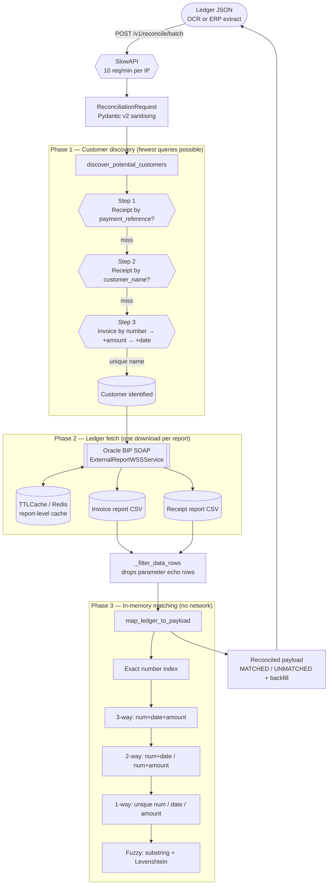

# Oracle BIP Reconciler

[](https://github.com/Shreyansh2203/oracle-bip-reconciler/actions)
[](LICENSE)
[](pyproject.toml)
[](https://fastapi.tiangolo.com)
[](https://github.com/astral-sh/ruff)

A production reconciliation service that matches a payment/receipt ledger row — often a photo of a paper remittance advice, read by OCR — against the customer's real invoice and receipt history in **Oracle Fusion ERP Cloud BI Publisher**. The incoming JSON is repaired in place: truncated invoice numbers, mistyped amounts and mixed date formats are resolved back to the authoritative Oracle record, or explicitly marked `UNMATCHED`.

---

## The problem

Remittance data arrives in whatever shape the customer's bank produced. In practice that means:

- **OCR noise.** `INV‑0001234` arrives as `INV-0001234S`, or truncated to `INV-00012`.
- **Money as text.** `"1,234.56"`, `"1234.56 "`, `"none"`, `"(1,234.56)"`, `"1.234,56"`.
- **Every date format at once.** `2026-10-05`, `13-06-2026`, `5 Oct 2026`, `20261005`, `2026-10-05T00:00:00Z`. A bare numeric order whose day and month are **both** valid — `05/10/2026` — is refused rather than guessed at, because the spelling does not say which is which; send an ISO date, a day above 12, or a month name.
- **You may not know the customer.** Sometimes only a payment reference is present; sometimes only a handful of invoice numbers.

Doing this as a straight join against Oracle is not an option. One BI Publisher report for a large tenant can return tens of thousands of rows and take minutes; issuing one query per invoice line will time out the upstream server and blow the caller's request budget.

The answer is a **three-phase engine**: identify the customer with the fewest possible queries, download their ledger **once**, then match everything in memory. Phase 3 makes zero network calls, so a 2,500-line batch costs the same number of round trips as a 1-line batch.

---

## Architecture



The detailed discovery, receipt and invoice rules are documented in
[docs/report_processing_rules.md](docs/report_processing_rules.md).

---

## The tiered invoice-matching algorithm

This is the core of the service. Each incoming invoice line is resolved against the
customer's downloaded ledger using progressively looser tiers. The first tier that produces
a match wins, and **a match is only accepted when it is unambiguous**.

Before matching starts, every Oracle row is normalised **once** — invoice number key,
date folded to `YYYY-MM-DD`, amount coerced to `float`. All later comparisons are then
plain equality checks.

### 0. Already-mapped rows are excluded

A per-row `mapped` flag, not a set of invoice numbers, tracks consumption. This matters:
a customer can legitimately have two ledger rows with the same invoice number (partial
shipments, split payments, a credit memo), and a number-keyed set cannot tell them apart —
it would starve the second one of its match.

### 1. Three-way match — number + date + amount *(highest confidence)*

Exact number hit through a dictionary index built from the ledger, then both the date and
the amount agree. This is the only tier that repairs a fully correct row.

### 2. Two-way match — number + date, or number + amount

Exact number hit, and one of the other two fields agrees. Safe because the number already
pins the row to a small candidate set.

### 3. One-way match — number, date, or amount *(only if unique)*

Exact number with a **single** unmapped candidate takes it even when date and amount both
disagree. Date-only and amount-only matches are accepted **only when exactly one** unmapped
row agrees; if two rows share a date, or two share an amount, the line is left
`UNMATCHED` rather than guessed.

### 4. Fuzzy number match — OCR recovery

Runs only when the number is not an exact dictionary hit. `_is_num_ok` accepts:

| Relationship | Rule | Rationale |
|---|---|---|
| Equal | exact, case-sensitive | — |
| Substring, either direction | both sides **≥ 5** characters, case-sensitive | OCR truncation of a long number |
| Levenshtein ≤ 1 | shorter side **≤ 6** characters | single-character misread of a short number |
| Levenshtein ≤ 2 | shorter side **> 6** characters | two misreads of a longer number |

The minimum length and the typo budget both key off the **shorter** of the two numbers. A
truncated OCR input is usually *shorter* than the Oracle number, so budgeting from the
input would hand a 6-character Oracle number the same slack as a 20-character one — which
is how `"ABCDEFG"` ends up "matching" an unrelated `"ABCDEX"`.

Fuzzy candidates are split into two buckets, and **only corroborated ones outrank the 1-way
tiers**:

1. fuzzy number **and** a date or amount agreement → beats everything below 3-way
2. fuzzy number alone → used only if nothing else matched, **and only when exactly one row
   is a candidate**

The second bucket has no corroboration of any kind, so it is held to the same uniqueness
rule as the amount-only and date-only buckets. Ledger order alone is not evidence.

### What the tiers deliberately do *not* do

They never re-query Oracle. Every tier is a pure function over the ledger already in
memory, which is what keeps a 2,500-line batch inside a single request.

### A number two rows share is not a match

`_is_num_ok` also returns true for an exact string, so the 1-way tier's uniqueness guard
(§3) used to be undone immediately afterwards by the fuzzy bucket (§4): if two unmapped rows
shared the *exact* invoice number and both date and amount disagreed, the 1-way tier
refused the match and then `matches_fuzzy_num[0]` took the first row in ledger order. The
guard did nothing for an exact number, only for a fuzzy one. With the bare fuzzy bucket
gated on `len(...) == 1`, the 1-way guard does what §3 says it does, and a shared exact
number reaches review. This is pinned by
`test_the_1_way_exact_number_guard_refuses_a_number_two_rows_share`.

### Adding a tier

The rules for extending this list are in
[CONTRIBUTING.md](CONTRIBUTING.md#adding-a-matching-tier). The short version: the order is the
feature, work from the candidate set rather than the ledger, decide what happens when two
rows agree, and test that case.

---

## API reference

Interactive docs are served at `/docs` (Swagger UI) and `/redoc`.

### `POST /v1/reconcile/batch`

Rate limited to **10 requests/minute per client IP**. No API key.

Request body — every field is optional; the engine discovers what it can:

```jsonc
{
  "customer_name": "Acme Corp",        // Step 2 discovery input
  "payment_reference": "RCPT-8891",    // Step 1 discovery input
  "payment_date": "05-Oct-2026",
  "total_amount": "4,200.50",
  "header_id": 5512,
  "invoices": [                        // max 2500
    {
      "line_id": 1,
      "invoice_number": "INV-00012",   // may be OCR-damaged
      "invoice_date": "05-Oct-2026",
      "invoice_amount": "1,234.56",
      "customer_invoice_number": "CN-99",
      "store_no": "S-104"
    }
  ]
}
```

A successful response is the **same object, repaired** — matched fields overwritten with
the authoritative Oracle values, unmatched fields left alone:

```jsonc
{
  "fusion_customer_name": "Acme Corp",
  "fusion_receipt_number": "RCPT-8891",
  "fusion_receipt_date": "2026-10-05",
  "fusion_applied_amount": 4200.50,
  "fusion_currency": "USD",
  "fusion_receipt_status_code": "APPLIED",
  "fusion_customer_number": "C-77",

  "invoices": [
    {
      "invoice_number": "INV-000123",      // repaired from "INV-00012"
      "invoice_date": "2026-10-05",        // Oracle's own string, see below
      "invoice_amount": 1234.56,
      "fusion_invoice_number": "INV-000123",
      "fusion_invoice_date": "2026-10-05",
      "fusion_invoice_amount": 1234.56,    // a JSON number, not "1,234.56"
      "match_phase": "MATCHED"             // or "UNMATCHED"
    }
  ],
  "invoice_count": 1
}
```

#### Types of the `fusion_*` fields

`fusion_*` is the Oracle record that won. Read these literally:

| Field | JSON type | Contract |
|---|---|---|
| `fusion_invoice_number` | `string \| null` | The ledger's number, verbatim. |
| `fusion_invoice_date` | `string \| null` | The ledger's date **string**, verbatim — `"08/14/2026"` if that is what Oracle returned. It is *not* normalised to `YYYY-MM-DD`; the normalised value only ever existed inside the matcher. Compare with `format_oracle_date` rather than parsing it yourself. |
| `fusion_invoice_amount` | `number \| null` | Coerced to a JSON **number**. Oracle's `"9,500.25"` is serialised as `9500.25`, and a cell the engine cannot parse is `null`, never a string. |
| `fusion_receipt_number` / `fusion_receipt_date` | `string \| null` | Verbatim from the receipt row. |
| `fusion_applied_amount` | `number \| null` | Coerced, like the invoice amount. |
| `fusion_currency` / `fusion_receipt_status_code` / `fusion_customer_number` | `string \| null` | Verbatim. |

`InvoiceItem` sets `validate_assignment=True`, so these types are enforced on the writes the
engine performs, not only on the request that came in. Before that was on,
`fusion_invoice_amount` held the raw Oracle *string* behind a `float` annotation and clients
doing arithmetic on it got a `TypeError`. `invoice_amount` and `invoice_date` are then
overwritten with the same matched values, so a client that only needs the repaired number and
date can ignore the `fusion_*` pair entirely.

`ReconciliationRequest` deliberately does *not* set `validate_assignment`: its
`_set_invoice_count` is a `mode="after"` model validator that assigns a field, and an
after-validator that re-enters itself on every assignment recurses. Its float fields are
coerced at their single assignment site instead.

#### Complete field reference

The examples above are abridged. This is the whole surface, and
`tests/test_docs.py` fails if the two ever disagree — on field names, on each field's JSON
type, and on every bound a model declares.

**`ReconciliationRequest` — request *and* response.** A field you send is echoed back; a
field the engine fills in arrives populated.

| Field | JSON type | Direction | Notes |
|---|---|---|---|
| `customer_name` | `string \| null` | in | Discovery Step 2. Blank is treated as absent. `max_length` 512. |
| `payment_reference` | `string \| int \| null` | in | Discovery Step 1. The primary key for the receipt. `max_length` 256. |
| `payment_date` | `string \| null` | in | Receipt fallback when there is no reference. `max_length` 512. |
| `total_amount` | `number \| null` | in | Receipt fallback, and the first thing the response carries. |
| `header_id` | `int \| string \| null` | in | Echoed only. Carried for the caller's own bookkeeping. `max_length` 256. |
| `invoices` | `InvoiceItem[]` | in | `max_length` 2500. Zero is legal: a receipt-only lookup carries no lines. |
| `meta_data` | `{"warnings": string[]}` \| `null` | out | Non-fatal notes about the run. |
| `_meta` | `dict \| null` | out | Reserved; currently always `{}` or `null`. The **wire name is `_meta`**, not `meta_extra` — FastAPI serialises by alias, and the field's Python name is only `meta_extra`. |
| `invoice_count` | `int \| null` | out | Server-set from `len(invoices)`; whatever you send is overwritten. |
| `fusion_customer_name` | `string \| null` | out | The customer the ledger answered with. |
| `fusion_receipt_number` | `string \| null` | out | See the `fusion_*` table above. |
| `fusion_receipt_date` | `string \| null` | out | Verbatim. |
| `fusion_applied_amount` | `number \| null` | out | Coerced. |
| `fusion_currency` | `string \| null` | out | Verbatim. |
| `fusion_receipt_status_code` | `string \| null` | out | Verbatim, e.g. `APPLIED`. |
| `fusion_customer_number` | `string \| null` | out | Verbatim. |
| `match_phase` | `"MATCHED" \| "UNMATCHED" \| null` | out | Batch-level roll-up. |
| `match_rule` | `string \| null` | out | Which tier decided it. |
| `confidence_label` | `string \| null` | out | Reserved; currently always `null`. |
| `confidence_score` | `number \| null` | in | **Input**, bounded `ge` 0.0 and `le` 1.0. Echoed back; the engine never computes it. A value outside that range is a `422`. |

**`InvoiceItem`** — one per invoice, nested in `invoices` on both sides.

| Field | JSON type | Direction | Notes |
|---|---|---|---|
| `line_id` | `int \| string \| null` | in | Your row id. Echoed back untouched. |
| `invoice_number` | `string \| int \| null` | in | May be OCR-damaged; the engine overwrites it on a match. `max_length` 256. |
| `invoice_date` | `string \| null` | in | Any format `format_oracle_date` accepts. `max_length` 512. |
| `invoice_amount` | `number \| null` | in | Coerced on the way in. |
| `customer_invoice_number` | `string \| int \| null` | in | Your own reference for the line. `max_length` 256. |
| `store_no` | `int \| string \| null` | in | Echoed back untouched. |
| `description` | `string \| null` | out | Not currently populated. `max_length` 512. |
| `fusion_invoice_number` | `string \| null` | out | The ledger's number, verbatim. |
| `fusion_invoice_date` | `string \| null` | out | The ledger's date string, verbatim. |
| `fusion_invoice_amount` | `number \| null` | out | A JSON number, not a string. |
| `match_phase` | `"MATCHED" \| "UNMATCHED" \| null` | out | Per line. `null` until the line is processed. |
| `match_rule` | `string \| null` | out | Which tier matched it. |

Every caller-supplied string is bounded, because a value reaches both the BI Publisher SOAP
envelope and the report cache key, and both are sized by whatever the caller sends. A value
past its bound is a `422` and the response does **not** echo the rejected payload back.

| Status | Meaning |
|---|---|
| `200` | Reconciled. **A `null` body means the customer could not be identified** — not an error. |
| `422` | Payload failed Pydantic validation (e.g. more than 2,500 invoices, a string past its length bound, `confidence_score` outside 0.0–1.0). The body carries each error's `type`, `loc` and `msg` and **not** the offending value, so a 2,501-invoice rejection does not return 2,501 invoices. |
| `429` | Rate limit exceeded. **No `Retry-After` header is sent** — slowapi does not emit one. Wait for the window to turn over (60 s) before retrying. |
| `500` | An unhandled error inside this service. The body is a fixed message; the cause is written to the server log only. |
| `502` | Oracle ERP was unreachable or errored. The response carries a **fixed** message; the upstream detail is written to the server log only. |
| `503` | The service is refusing to serve, on purpose. Either `ALLOW_UNAUTHENTICATED_ACCESS` is not set, or `/ready` found the Oracle credentials unconfigured. |

### `GET /`

Landing page (`src/templates/index.html`).

### `GET /health`

`{"status": "ok"}` — liveness. Unthrottled, and performs no I/O.

### `GET /ready`

`{"status": "ready"}`, or `503` when Oracle credentials are unconfigured. Unthrottled.

### `GET /docs`, `GET /redoc`, `GET /openapi.json`

Generated API documentation.

---

## Configuration

All configuration is environment-driven, read once at import by `src/core/config.py`.
Copy the template and edit it:

```bash
cp .env.example .env
```

| Variable | Default | Description |
|---|---|---|
| `ORACLE_URL` | *required* | ERP Cloud base URL. Must be `https://`, or `http://` only for loopback. Trailing slash stripped. |
| `ORACLE_USER` | *required* | BI Publisher service account. |
| `ORACLE_PASS` | *required* | Service account password. `repr=False`, so it is masked in `str()`/`repr()` and in `ValidationError` output. |
| `CORS_ORIGINS` | `""` | Comma-separated browser origins. **Empty fails closed** — no `Access-Control-Allow-Origin` is emitted, so browsers refuse to expose the response. Non-browser clients are unaffected, as always with CORS. |
| `ALLOW_INSECURE_ORACLE_HTTP` | `false` | Permit a plain `http://` `ORACLE_URL` for a non-loopback host. |
| `ALLOW_UNAUTHENTICATED_ACCESS` | `false` | Whether the reconciliation endpoint serves at all. **It refuses every request while this is `false`**, because it returns a named customer's entire ledger and the Oracle service account is tenant-wide. Set it to `true` only behind an authenticating proxy, or when you have accepted that the endpoint is unauthenticated. See [Security](#security). |
| `TRUSTED_PROXY_HEADERS` | `false` | Read the rate-limit bucket from `X-Forwarded-For`. Left `false`, the limiter buckets by the socket peer, which behind a shared proxy is one bucket for every caller. Set it to `true` only when the thing in front **overwrites** the header. |
| `REDIS_URL` | *empty* | Shared report cache. Falls back to an in-process TTL cache. |
| `ORACLE_BIP_INVOICE_PATH` | *empty* | Absolute `.xdo` path, overriding the default in `src/constants.py`. |
| `ORACLE_BIP_RECEIPT_PATH` | *empty* | Absolute `.xdo` path, overriding the default. |
| `BIP_CACHE_TTL_SECONDS` | `60` | Report cache lifetime. |

`.env` is gitignored. Never commit real credentials, and never commit live customer or
financial data — `Customers.txt` and `Real Test Cases/` are ignored for that reason.

---

## Local development

```bash
# Install (uv resolves the lockfile)
uv sync

# Run on http://127.0.0.1:8000 with hot reload
uv run task start          # or: make dev
```

`uv` and `taskipy` are the only prerequisites — there is no need for a virtualenv to exist
first, `uv` creates it. **Python 3.12 or newer** is required and is what the gates run on;
3.9–3.11 are end-of-life or unsupported and are no longer resolved by `uv.lock`.

### Quality gates

```bash
uv run task check_all      # or: make check
```

runs, in order:

| Task | Tool | What it enforces |
|---|---|---|
| `lint` | ruff | pycodestyle, pyflakes, isort, bugbear, comprehensions, pyupgrade |
| `types` | mypy | static types across `src/` and `api/` |
| `security` | bandit | common security anti-patterns |
| `deadcode` | vulture | unreachable code at ≥ 80 % confidence |
| `test` | pytest | the full suite, against a test-count and a coverage floor |

`uv run task lint`, `types`, `security`, `deadcode` and `test` can be run individually.

All five run as one `test` job in CI. Alongside it:

| Workflow | What it enforces |
|---|---|
| `ci.yml` → `test` | `check_all`, plus `uv lock --check` so a hand-edited lockfile cannot ship |
| `ci.yml` → `dependency-audit` | `pip-audit` over `requirements.txt` and over the dev toolchain, separately |
| `ci.yml` → `dependency-review` | `dependency-review-action` on the pull request diff, failing at `moderate` |
| `codeql.yml` | CodeQL for `python` and `actions`, on push, on pull request, and weekly |

Every action in both workflows is pinned to a full commit SHA with the tag kept as a
trailing comment, and every job carries a `timeout-minutes`, so a hung step is a red X
rather than a job that quietly occupies a runner.

### The two floors

Both floors are set just below what the suite genuinely achieves, so they catch a
regression rather than a rounding difference, and both are stated in exactly these words
here and in [CONTRIBUTING.md](CONTRIBUTING.md#the-gates) — the gate and the measurement
travel together, and `tests/test_docs.py` fails if the two documents ever part company:

- **Coverage** of `src/` and `api/`: measured **100.00 %**, floor **98 %**
  (`fail_under` in `[tool.coverage.report]`).
- **Tests collected**: measured **300**, floor **283** (`MIN_TESTS` in `tests/conftest.py`).

`tests/test_docs.py` reads both numbers out of this file, and also reads the real collected
count out of the running pytest session, so a figure that stops being true fails a gate
rather than sitting here looking authoritative. Change `fail_under` and `MIN_TESTS` in the
commit that earns the new number, and quote the new measurement here and in
CONTRIBUTING.md in that same commit.

`precision = 2` is required and load-bearing, because coverage.py compares the *rounded
display value*. At the default precision of 0 a 99.5 % run displays as `100` and a
`fail-under` of 99.99 silently passes; the two-decimal value is what makes the floor mean
what it says. A narrowed run (`-k`, `-m`, `--collect-only`) is allowed below the count
floor, because narrowing is deliberate; a plain `pytest tests/some_file.py` is not, because
that is how a refactor quietly deletes tests while every other gate stays green.

To raise either floor, add the tests that earn it in the same commit. There are no
`# pragma: no cover` directives anywhere in this repository, and
`[tool.coverage.report].exclude_also` — which excludes only `if TYPE_CHECKING:`,
`if __name__ == "__main__":` and `raise NotImplementedError` — matches **no line at all** in
`src/` or `api/`. So the 100.00 % above is a measurement, not a filtered one.
`tests/test_docs.py` asserts both halves of that sentence, so neither can start being false
without a gate failing.

### Dependency audit

```bash
uv run task audit        # pip-audit against requirements.txt
```

This one needs network access, which is why it is **not** in `check_all` — a gate that
cannot run offline is a gate people learn to skip. It is a real gate in CI instead, as its
own `dependency-audit` job:

- runs on every push and pull request, and
- runs on a schedule, **Mondays at 06:17 UTC**, because advisories are published
  continuously and a scan that only ran on push would miss one published for a dependency
  that is already merged.

It audits `requirements.txt` — the exact set Vercel and Render install — and separately the
development toolchain, so a CVE in a linter neither hides nor blocks a finding in a runtime
package. `pip-audit` exits non-zero on a finding, and `--strict` also fails on a requirement
it cannot resolve, so a malformed export cannot pass as "no known vulnerabilities". Both
commands were verified to exit 1 against a deliberately vulnerable pin and exit 0 against
this lockfile.

Dependabot (`.github/dependabot.yml`) opens the PRs that keep the pinned action SHAs and
`uv.lock` current.

### Testing notes

`Settings` requires `ORACLE_URL`, `ORACLE_USER` and `ORACLE_PASS` at import time, so the
suite needs them present — CI sets throwaway values, and `http://localhost:8080` is accepted
by the URL validator without any opt-in. Nothing in the suite reaches the network: Oracle is
mocked at the HTTP transport with `respx` in `tests/test_oracle_bip.py` and
`tests/test_reconciliation_batch.py`, and at the discovery seam elsewhere. `.invalid`
hostnames are used throughout, never a real tenant.

```bash
uv run pytest -q
uv run pytest tests/test_reconciliation_mapping.py -q   # the matching engine
```

---

## Docker

```bash
docker build -t oracle-reconciliation-api .
docker run --env-file .env -p 8000:8000 oracle-reconciliation-api
```

The image is a two-stage build on a digest-pinned
`python:3.13.7-slim-bookworm` base. The **builder** stage runs `uv sync --frozen --no-dev`
into `/app/.venv` and is then discarded, so neither the wheel toolchain nor the uv cache
reaches the shipped image. The **runtime** stage copies that venv in whole, along with `src/`
and `api/`, and runs as uid/gid **10001** — never root. uv comes from a digest-pinned
`ghcr.io/astral-sh/uv` image rather than `pip install uv`, which resolved to whatever was
newest on the day the image happened to be built.

`PYTHONPATH=/app` and `PATH="/app/.venv/bin:$PATH"` are set explicitly, so the uvicorn
workers import `src.main` and resolve the `uvicorn` entry point regardless of the working
directory the image is started from.

`HEALTHCHECK` hits the real `GET /health` using `urllib` from the standard library — no
`curl`, no extra package, and exec form so there is no shell to inject through. It points
at `/health` rather than `/ready` deliberately: `/ready` returns `503` until the Oracle
credentials are configured, and an operator who has not set them yet should see a *running*
container, not an unhealthy one.

`.dockerignore` keeps the host virtualenv, `.git` and caches out of the build context —
without it the build context is ~300 MB and the host's virtualenv overwrites the one in the
image.

---

## Deployment

### Render

`render.yaml` defines a Python web service: `uv sync --frozen --no-dev` at build, then
`.venv/bin/uvicorn src.main:app` bound to `$PORT` with two workers. Three details are
deliberate:

- **`--frozen`** so the build installs exactly what `uv.lock` pins and never re-resolves, and
  **`--no-dev`** so the test and lint tooling is not in the production image.
- **The interpreter is named explicitly.** Render does not promise to put `.venv/bin` on
  `PATH` for a custom build command, and a bare `uvicorn` is a build that succeeds followed by
  a runtime that cannot start.
- **`ORACLE_URL`, `ORACLE_USER` and `ORACLE_PASS` use `sync: false`**, because `Settings` has
  no default for them and Render should prompt rather than start with a placeholder. The six
  optional settings carry their documented default instead, so a deploy is not blocked on a
  prompt for a value the service does not need.

The blueprint declares exactly the nine variables the code reads — six through `Settings`, three
through `os.getenv` — and nothing else. The earlier `ENV`, `MAX_CONCURRENCY`, `ORACLE_LIMIT` and
`ORACLE_MAX_PAGES` entries were read by nothing at all; if they still exist in your Render
dashboard, delete them there. `tests/test_deploy_contract.py` fails if the blueprint and the
code drift apart again.

### Vercel

There is exactly **one** application object, `app` in `src/main.py`. `api/index.py` is a
one-line re-export of it:

```python
from src.main import app  # noqa: F401
```

This is deliberate, not duplication. Vercel's Python builder only discovers an ASGI app
from a module inside `api/`, and `vercel.json` rewrites `/(.*)` to that module — the
rewrite is required, without it every path 404s.

#### Set the three credentials in the dashboard, or every request 500s

**This is the step that is easy to miss, because the build succeeds.** `src/core/config.py`
evaluates `Settings()` at *import* time and `ORACLE_URL`, `ORACLE_USER` and `ORACLE_PASS`
have no defaults. `api/index.py` imports the app in the function's **init** phase, so a
deployment without those three variables fails at cold start, not at build: the build is
green, and then `/`, `/health`, `/ready` and `/v1/reconcile/batch` all return **500** on
every request.

`vercel.json` cannot set them for you. It uses `builds`, and `env` and `builds` are
mutually exclusive in Vercel's configuration, so there is no place in this file to declare
them. The only place is the dashboard:

1. Open the project on Vercel → **Settings** → **Environment Variables**.
2. Add `ORACLE_URL`, `ORACLE_USER` and `ORACLE_PASS`, for **all** environments
   (Production and Preview) or the preview URLs 500 too.
3. Also add `ALLOW_UNAUTHENTICATED_ACCESS=true`. The endpoint serves whole-customer ledgers
   and cannot authenticate the caller, so it refuses every request until you set this. See
   [Security](#security).
4. Redeploy. Environment variable changes do not apply to an existing deployment.

After changing anything here, check a **request**, not the build log. `GET /health`
returning `{"status": "ok"}` is the signal that the import succeeded.

`requirements.txt` is the `uv export` pin set that the Vercel runtime installs, regenerated
with:

```bash
uv export --no-dev --no-emit-project --format requirements-txt -o requirements.txt
```

Regenerate it whenever `pyproject.toml`'s runtime dependencies or `uv.lock` change. A drift
here is silent until a deploy, and that is exactly how the last one failed: the export was
missing `pydantic-settings` and `redis`, both declared runtime dependencies, so the runtime
could not import the app. `tests/test_deploy_contract.py` asserts that every declared
runtime dependency is pinned, that no dev-only package leaked in, and that the blueprint,
`vercel.json` and `api/index.py` still agree.

`vercel.json` also pins `"framework": null`. This repository matches Vercel's FastAPI
preset signature exactly — `fastapi` is a declared dependency **and** `src/main.py` is an
entrypoint Vercel recognises — and `null` is the documented way to select the "Other"
preset. Without it, the only thing keeping the preset off is the presence of `builds`,
which Vercel calls legacy. `tests/test_deploy_contract.py` asserts the signature is present
*and* that the opt-out is present, so neither can be removed without a test failing.

### Self-hosted

```bash
uv sync --no-dev
uvicorn src.main:app --host 0.0.0.0 --port 8000 --workers 2
```

Run the ASGI app behind a TLS-terminating proxy. `ORACLE_PASS` travels in the SOAP
envelope and in HTTP basic auth, so plain `http://` to a remote Oracle host is refused at
startup unless `ALLOW_INSECURE_ORACLE_HTTP=true`.

---

## Security

Read [SECURITY.md](SECURITY.md) first. A real Oracle BI Publisher service-account
credential was once committed to this repository's history; it has been purged from the
working tree and from git history, but **it must still be rotated in Oracle** — purging
cannot un-leak it for anyone who cloned before the rewrite. `SECURITY.md` documents the
incident and the exact rotation procedure.

Design notes:

- **The endpoint fails closed.** `POST /v1/reconcile/batch` returns **503 for everyone**
  until `ALLOW_UNAUTHENTICATED_ACCESS=true` is set. It is not a rate limit in place of
  authentication: the rate limit is ten requests a minute, and a caller naming a customer
  receives that customer's **entire** invoice and receipt ledger, because the Oracle service
  account is tenant-wide. The service cannot authenticate the caller, so the decision is
  yours and it defaults to "no". `vercel.json` and `render.yaml` both produce a publicly
  reachable URL, which is why this is on by default rather than documented as a caveat.
- **Put it behind an authenticating proxy.** A gateway, an API gateway, an ingress with
  auth, or anything that terminates TLS and checks a credential *before* the request
  reaches this service. That proxy is the authentication; this service is the reconciler.
- **No API key of its own.** Authentication is the responsibility of the caller or the
  gateway; the service exposes a rate limit rather than a shared secret.
- **Fail-closed CORS** by default, and `allow_credentials=False` throughout.
- **Rate limiting** on the reconciliation endpoint only; health endpoints stay unthrottled
  so orchestrators are never locked out. The bucket key is the socket peer unless
  `TRUSTED_PROXY_HEADERS=true`, in which case it is the last `X-Forwarded-For` entry —
  the one the edge appended, so a caller who forges a leading entry is ignored. Behind a
  proxy that does not set the header, all callers share one bucket; the limit is a
  protection against a single misbehaving client, not against a distributed one.
- **Safe XML parsing** — `defusedxml` for the SOAP envelope, so a hostile or malformed
  Oracle response cannot mount an entity-expansion attack.
- **No internal error text crosses the wire.** Oracle exceptions are logged with their type
  and message; the client receives a fixed 502 message. A `422` reports each error's type,
  location and message but not the rejected value, so a refused batch does not come back
  with the whole batch attached.
- **Bounded memory and bounded input** — the report cache is a `TTLCache` (or Redis), not
  an unbounded dict, and every caller-supplied string has a length bound because it
  reaches both the SOAP envelope and the cache key.
- `bandit` runs in CI and locally via `uv run task check_all`, and dependencies are
  scanned by `pip-audit` on every build.

---

## Contributing

[CONTRIBUTING.md](CONTRIBUTING.md) has the full version: how to run the gates, how to add a
matching tier, conventional commits, and the rule that no test may point at a real Oracle
tenant. The short version:

1. `uv sync`
2. `uv run task check_all` must pass before you push.
3. Keep changes focused. If you touch `map_ledger_to_payload`, add or update the cases in
   `tests/test_reconciliation_mapping.py` — the tier ordering is load-bearing behaviour,
   not an implementation detail.

## Portfolio

Other repositories in the same portfolio, by the same author. Each is a separate project with
its own scope; they share nothing but an owner.

| Repository | What it is |
|---|---|
| [Merge-TIFF](https://github.com/Shreyansh2203/Merge-TIFF) | Next.js and a Python/Pillow serverless function that merge several TIFF files into one multi-page TIFF. |
| [OTL-Voice](https://github.com/Shreyansh2203/OTL-Voice) | Voice timesheet assistant — FastAPI and a React/TypeScript client that turns spoken overtime entries into a timesheet. |
| [Product-Comparison-Advisor-AI-Agent](https://github.com/Shreyansh2203/Product-Comparison-Advisor---AI-Agent) | Agent configuration and orchestrator for Oracle Fusion SCM product-comparison workflows. |
| [Scraping-Bot](https://github.com/Shreyansh2203/Scraping-Bot) | Telegram bot that downloads media behind Instagram and Twitter/X links. |

The Oracle theme is shared by this service and the product-comparison agent; the other two
are unrelated.

## License

[MIT License](LICENSE).
